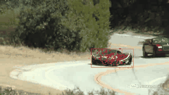

# CPU parallel computing adaptive color-based particle filter for robust video object tracking

This repository contains the code for my project called: "CPU parallel computing adaptive color-based particle filter for robust video object tracking". It presents a robust, real-time object tracking system implemented using an adaptive color-based Particle Filter. The method is inspired by [Nummiaro et al. (2002)](https://www.sciencedirect.com/science/article/pii/S0262885602001294), and enhanced with parallel computing strategies and a novel integration of clustering to manage multiple hypotheses. The system is resilient to object transformations such as scale changes, rotations, and occlusions, and supports efficient computation on both local machines and high-performance clusters. Experimental results demonstrate strong performance on challenging video sequences.

# Code Overview

- **`video_to_frames.py`**  
  Extracts and save frames from an input video.
  
- **`main.py`**  
  Main script to run the particle filter tracker on extracted video frames. Configure parameters here before launching.

- **`utils.py`**  
  Contains helper functions.

- **`makegif.py`**  
  Converts a sequence of saved image frames into a compressed `.gif` animation for visualizing the outputs of our model:
  

# Acknowledgements

This implementation builds on Lang Tang's implementation: [https://github.com/tanglang96/particle-filter](https://github.com/tanglang96/particle-filter).
